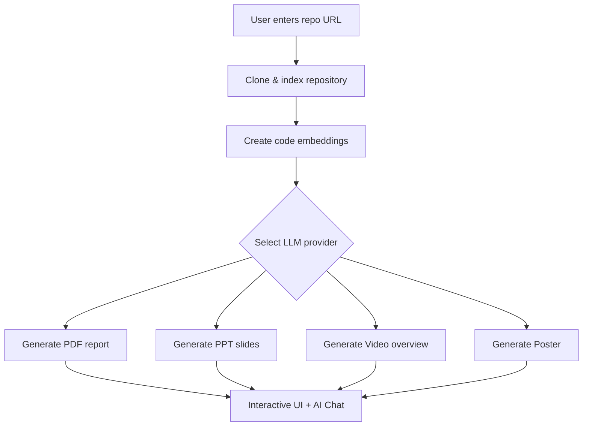
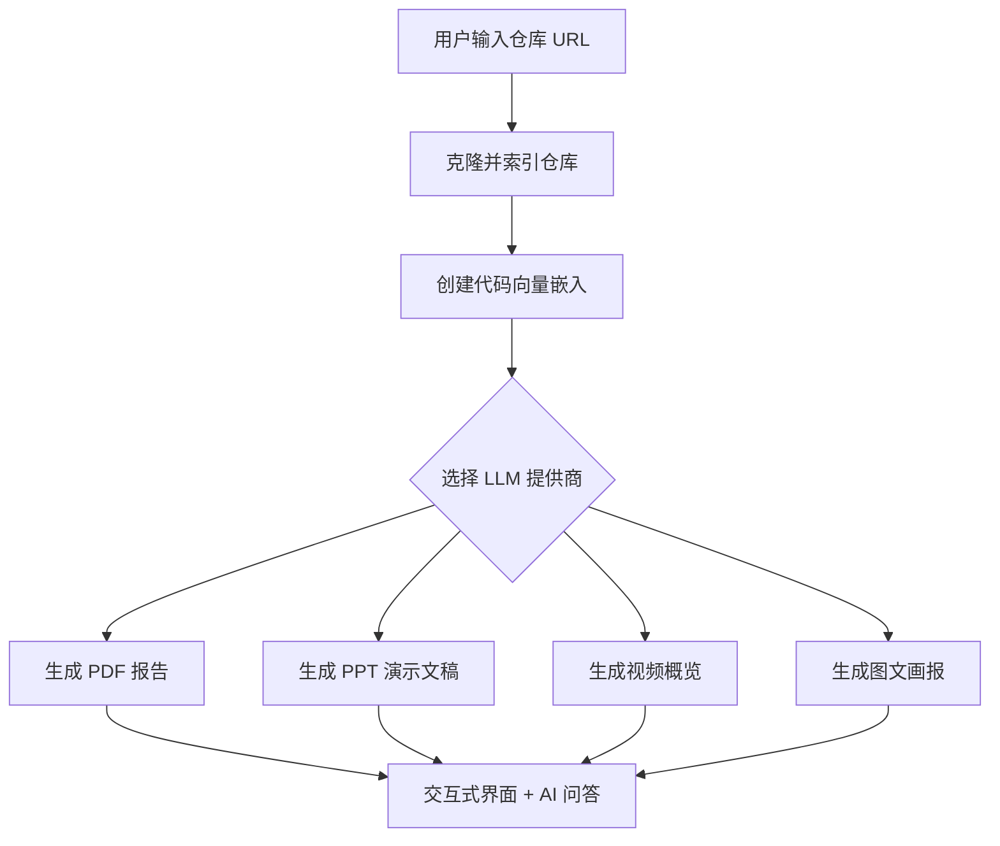

# RepoHelper

> AI-powered repository documentation generator

RepoHelper analyzes any GitHub, GitLab, or Bitbucket repository and produces structured, navigable technical documentation enriched with Mermaid diagrams. It also supports local folder analysis, PDF/PPT/Video/Poster export, and interactive AI chat powered by RAG.

---

## Features

| Capability | Description |
|---|---|
| **Auto Documentation** | Auto-generates multi-page documentation from repository code structure |
| **Diagram Generation** | Mermaid flow charts, sequence diagrams, and architecture visuals |
| **AI Chat (Ask)** | RAG-powered Q&A — ask questions about any repository |
| **Agent Chat** | Intelligent agent with intent classification, ReAct reasoning, and deep research |
| **Multi-provider LLM** | Google Gemini, OpenAI, OpenRouter, Azure OpenAI, Ollama, AWS Bedrock, DashScope |
| **Flexible Embeddings** | OpenAI, Google AI, Ollama, or Bedrock embedding backends |
| **Export** | PDF reports, PowerPoint slides, video overviews, illustrated posters, Markdown, JSON |
| **Private Repos** | Secure token-based access for GitHub / GitLab / Bitbucket private repositories |
| **Local Analysis** | Point to a local folder path instead of a remote URL |
| **Memory System** | Multi-tier memory (short-term → episodic → long-term) for contextual conversations |
| **MCP Tools** | Model Context Protocol integration for standardized tool execution |
| **Observability** | Langfuse tracing + performance monitoring |
| **Eval Framework** | Offline benchmarks for ReAct, intent classification, and RAG subsystems |
| **i18n** | English & Chinese UI, extensible to more languages |
| **Dark / Light Theme** | System-aware theme toggle |

---

## Quick Start

### 1. Backend

```bash
# Install Poetry and project dependencies
pip install poetry==2.0.1
poetry install -C api

# Start the API server on :8001
python -m api.main
```

### 2. Frontend

```bash
# Install Node.js dependencies and start dev server on :3000
npm install
npm run dev
```

### 3. Environment Variables

Create a `.env` file in the project root with at least one provider key:

```bash
OPENAI_API_KEY=sk-...
GOOGLE_API_KEY=AI...

# Optional
OPENROUTER_API_KEY=...
AZURE_OPENAI_API_KEY=...
AZURE_OPENAI_ENDPOINT=...
AZURE_OPENAI_VERSION=...
OLLAMA_HOST=http://localhost:11434
DEEPWIKI_EMBEDDER_TYPE=openai   # openai | google | ollama | bedrock
```

Open <http://localhost:3000>.

> Data is persisted at `~/.adalflow` (repos, embeddings, documentation cache).

### Generate Test Cases (Optional)

```bash
# Preview
python -m eval.offline.generate_testcases --dry-run

# Generate with default 5 repos
python -m eval.offline.generate_testcases --provider openai --model gpt-4o

# Specify repos
python -m eval.offline.generate_testcases --provider openai --model gpt-4o \
    --repo https://github.com/pallets/flask \
    --repo https://github.com/psf/requests

# Include local projects
python -m eval.offline.generate_testcases --provider ollama --model qwen3:8b --verbose --include-local

# Clean cache
python -m eval.offline.generate_testcases --clean-cache
```

---

## How It Works



1. Clone and analyze the repository (supports private repos with token auth)
2. Create vector embeddings of the code for smart retrieval
3. Select an LLM provider (Google, OpenAI, OpenRouter, Ollama, etc.)
4. Export as PDF report, PPT slides, video overview, or illustrated poster
5. Browse results in the interactive UI with AI-powered Q&A

---

## Architecture

```
RepoHelper/
├── api/                        # Python FastAPI backend
│   ├── main.py                 # Entry point
│   ├── api.py                  # Route definitions & export endpoints
│   ├── rag.py                  # Retrieval Augmented Generation
│   ├── data_pipeline.py        # Repo cloning, indexing, embedding
│   ├── export_service.py       # Unified export orchestrator
│   ├── pdf_export.py           # PDF report renderer
│   ├── ppt_export.py           # PPT slide renderer
│   ├── poster_export.py        # Poster/infographic renderer (Gemini image gen)
│   ├── content_analyzer.py     # Content analysis pipeline
│   ├── provider_factory.py     # LLM provider factory
│   ├── simple_chat.py          # Streaming chat handler
│   ├── tts_service.py          # Text-to-Speech service
│   │
│   ├── agent/                  # Intelligent agent system
│   │   ├── planner.py          # Rule-based intent planner (keyword + fuzzy matching)
│   │   ├── intent_classifier.py # Two-tier classification (embedding → LLM fallback)
│   │   ├── scheduler.py        # Three-tier intent routing & action dispatch
│   │   ├── react.py            # ReAct loop (Thought → Action → Observation)
│   │   ├── deep_research.py    # Multi-phase research orchestrator
│   │   ├── events.py           # Async event lifecycle definitions
│   │   └── tools/              # Agent tools (search, read, export)
│   │
│   ├── memory/                 # Multi-tier memory system
│   │   ├── manager.py          # Unified memory API
│   │   ├── short_term.py       # Working memory (sliding window)
│   │   ├── episodic.py         # Session-scoped memory
│   │   ├── long_term.py        # Persistent knowledge base (SQLite + FTS5)
│   │   ├── consolidation.py    # Episodic → long-term promotion
│   │   └── models.py           # Memory data models
│   │
│   ├── mcp/                    # Model Context Protocol
│   │   ├── registry.py         # Tool registration & execution
│   │   └── integration_guide.py
│   │
│   ├── video/                  # Video export pipeline
│   │   ├── orchestrator.py     # Main render pipeline
│   │   ├── storyline.py        # Scene sequencing
│   │   ├── card_builder.py     # Scene content builder
│   │   ├── pillow_renderer.py  # Image rendering
│   │   ├── narration.py        # TTS script generation
│   │   ├── compose.py          # Video composition & encoding
│   │   └── progress.py         # Progress tracking
│   │
│   ├── monitoring/             # Performance metrics collection
│   ├── tracing/                # Langfuse v4 observability
│   ├── routes/                 # API router definitions
│   ├── config/                 # generator.json, embedder.json, repo.json
│   └── tools/                  # Embedder utilities
│
├── src/                        # Next.js 15 frontend (React 19)
│   ├── app/                    # App Router pages
│   │   ├── page.tsx            # Home — repo input + feature overview
│   │   ├── chat/               # Agent chat page
│   │   ├── pdf-viewer/         # PDF document viewer
│   │   ├── [owner]/[repo]/     # Documentation viewer page
│   │   │   ├── workshop/       # Workshop/editor mode
│   │   │   └── slides/         # Slide viewer
│   │   └── api/                # Next.js API route proxies
│   │       └── export/         # repo-pdf, repo-ppt, repo-video, repo-poster
│   ├── components/             # Reusable UI components
│   ├── contexts/               # Language context provider
│   └── messages/               # i18n JSON (en, zh)
│
├── eval/                       # Evaluation & benchmarking
│   ├── offline/                # Offline benchmarks (ReAct, intent, RAG)
│   └── online/                 # Online evaluation
│
├── tests/                      # Test suite
│   ├── unit/                   # Unit tests
│   ├── integration/            # Integration tests
│   └── eval/                   # Eval tests
│
└── .env                        # Your API keys (create this)
```

---

## Environment Variables

| Variable | Purpose | Required |
|---|---|---|
| `OPENAI_API_KEY` | OpenAI models & default embeddings | If using OpenAI |
| `GOOGLE_API_KEY` | Google Gemini models & Google embeddings | If using Google |
| `OPENROUTER_API_KEY` | OpenRouter model access | If using OpenRouter |
| `AZURE_OPENAI_API_KEY` | Azure OpenAI | If using Azure |
| `AZURE_OPENAI_ENDPOINT` | Azure endpoint | If using Azure |
| `AZURE_OPENAI_VERSION` | Azure API version | If using Azure |
| `OLLAMA_HOST` | Ollama server URL (default `http://localhost:11434`) | If using Ollama |
| `AWS_ACCESS_KEY_ID` / `AWS_SECRET_ACCESS_KEY` | AWS Bedrock credentials | If using Bedrock |
| `DEEPWIKI_EMBEDDER_TYPE` | `openai` \| `google` \| `ollama` \| `bedrock` | No (default `openai`) |
| `OPENAI_BASE_URL` | Custom OpenAI-compatible endpoint | No |
| `DEEPWIKI_CONFIG_DIR` | Custom config directory path | No |
| `DEEPWIKI_AUTH_MODE` | `true` to require auth code | No |
| `DEEPWIKI_AUTH_CODE` | Secret code when auth mode is enabled | If auth mode on |
| `PORT` | API server port (default `8001`) | No |
| `SERVER_BASE_URL` | Backend URL for frontend proxy (default `http://localhost:8001`) | No |
| `LOG_LEVEL` | `DEBUG` / `INFO` / `WARNING` / `ERROR` | No (default `INFO`) |
| `LOG_FILE_PATH` | Custom log file path | No |
| `LANGFUSE_PUBLIC_KEY` | Langfuse tracing public key | No |
| `LANGFUSE_SECRET_KEY` | Langfuse tracing secret key | No |
| `LANGFUSE_HOST` | Langfuse server URL | No |
| `LANGFUSE_ENABLED` | Enable/disable Langfuse tracing | No |

---

## Supported LLM Providers

| Provider | Default Model | Examples |
|---|---|---|
| **Google** | `gemini-2.5-flash` | `gemini-2.5-pro`, `gemini-2.5-flash-lite` |
| **OpenAI** | `gpt-4o` | `gpt-4o-mini`, `o3-mini` |
| **OpenRouter** | configurable | Claude, Llama, Mistral, and hundreds more |
| **Azure OpenAI** | `gpt-4o` | `o4-mini` |
| **Ollama** | `llama3` | Any locally installed model |
| **AWS Bedrock** | configurable | Amazon-hosted models |
| **DashScope** | `qwen-plus` | `qwen-turbo`, `deepseek-r1` |

---

## Embedding Backends

| Type | Model | Key Required |
|---|---|---|
| `openai` (default) | `text-embedding-3-small` | `OPENAI_API_KEY` |
| `google` | `text-embedding-004` | `GOOGLE_API_KEY` |
| `ollama` | configurable | None (local) |
| `bedrock` | Amazon Titan / Cohere | AWS credentials |

Switch with `DEEPWIKI_EMBEDDER_TYPE` env var. When switching, regenerate repository embeddings.

---

## Agent System

The agent chat provides intelligent, multi-step interactions:

| Component | Description |
|---|---|
| **Planner** | Rule-based keyword + fuzzy matching for fast intent detection |
| **Intent Classifier** | Two-tier fallback: embedding similarity → LLM classification |
| **Scheduler** | Three-tier cascade routing (planner → embedding → LLM) |
| **ReAct Runner** | Thought → Action → Observation loops for multi-step reasoning |
| **Deep Research** | Query decomposition → iterative RAG research → synthesis |
| **Export Tools** | PDF, PPT, Video, and Poster generation via agent actions |

---

## Memory System

| Tier | Storage | Purpose |
|---|---|---|
| **Short-term** | In-memory (sliding window) | Recent conversation turns (~50) |
| **Episodic** | In-memory + consolidation | Session-scoped context (~200 sessions) |
| **Long-term** | SQLite + FTS5 | Persistent knowledge base with semantic search |

Memories are automatically promoted from episodic to long-term via the consolidation engine.

---

## Troubleshooting

| Problem | Solution |
|---|---|
| Missing API key errors | Check `.env` is in project root with correct keys |
| Cannot connect to API | Ensure backend is running on port 8001 |
| Large repo fails | Try a smaller repo first, or use file filters to exclude directories |
| Diagram render error | Auto-repair is attempted; refresh if needed |
| Private repo 403 | Verify your personal access token has read permissions |

---

## Contributing

Issues and pull requests are welcome.

## License

MIT — see [LICENSE](LICENSE).

---
---

# RepoHelper（中文说明）

> AI 驱动的代码仓库文档自动生成工具

RepoHelper 可以分析任意 GitHub、GitLab 或 Bitbucket 仓库，自动生成结构化、可导航的技术文档，并附带 Mermaid 架构图。同时支持本地文件夹分析、PDF/PPT/视频/画报导出，以及基于 RAG 的智能问答。

---

## 功能一览

| 功能 | 说明 |
|---|---|
| **自动文档生成** | 根据代码结构自动生成多页文档 |
| **图表生成** | Mermaid 流程图、时序图、架构可视化 |
| **AI 问答 (Ask)** | 基于 RAG 的仓库智能问答 |
| **智能助手** | 意图分类 + ReAct 推理 + 深度研究的智能 Agent |
| **多模型支持** | Google Gemini、OpenAI、OpenRouter、Azure OpenAI、Ollama、AWS Bedrock、DashScope |
| **灵活的嵌入后端** | OpenAI、Google AI、Ollama 或 Bedrock 向量化 |
| **导出** | PDF 报告、PPT 演示文稿、视频概览、图文画报、Markdown、JSON |
| **私有仓库** | 通过 Token 安全访问 GitHub / GitLab / Bitbucket 私有仓库 |
| **本地分析** | 支持直接指定本地文件夹路径 |
| **记忆系统** | 多层记忆（短期→情景→长期），支持上下文连续对话 |
| **MCP 工具** | Model Context Protocol 标准化工具执行 |
| **可观测性** | Langfuse 追踪 + 性能监控 |
| **评估框架** | 离线基准测试（ReAct、意图分类、RAG） |
| **多语言界面** | 中英文 UI，可扩展 |
| **明暗主题** | 跟随系统或手动切换 |

---

## 快速开始

### 1. 后端

```bash
# 安装 Poetry 和项目依赖
pip install poetry==2.0.1
poetry install -C api

# 启动 API 服务（端口 8001）
python -m api.main
```

### 2. 前端

```bash
# 安装依赖并启动开发服务器（端口 3000）
npm install
npm run dev
```

### 3. 环境变量

在项目根目录创建 `.env` 文件，至少填写一个模型提供商的 Key：

```bash
OPENAI_API_KEY=sk-...
GOOGLE_API_KEY=AI...

# 可选
OPENROUTER_API_KEY=...
AZURE_OPENAI_API_KEY=...
AZURE_OPENAI_ENDPOINT=...
AZURE_OPENAI_VERSION=...
OLLAMA_HOST=http://localhost:11434
DEEPWIKI_EMBEDDER_TYPE=openai   # openai | google | ollama | bedrock
```

浏览器打开 <http://localhost:3000>。

> 数据持久化目录：`~/.adalflow`（包含克隆仓库、嵌入向量、文档缓存）。

### 生成测试用例（可选）

```bash
# 预览
python -m eval.offline.generate_testcases --dry-run

# 用默认 5 个仓库生成
python -m eval.offline.generate_testcases --provider openai --model gpt-4o

# 指定仓库
python -m eval.offline.generate_testcases --provider openai --model gpt-4o \
    --repo https://github.com/pallets/flask \
    --repo https://github.com/psf/requests

# 包含本地项目
python -m eval.offline.generate_testcases --provider ollama --model qwen3:8b --verbose --include-local

# 清理缓存
python -m eval.offline.generate_testcases --clean-cache
```

---

## 工作原理



1. 克隆并分析仓库（支持通过 Token 访问私有仓库）
2. 创建代码向量嵌入，用于智能检索
3. 选择 LLM 提供商（Google、OpenAI、OpenRouter、Ollama 等）
4. 导出为 PDF 报告、PPT 演示文稿、视频概览或图文画报
5. 在交互式界面中浏览结果，并使用 AI 智能问答

---

## 项目结构

```
RepoHelper/
├── api/                        # Python FastAPI 后端
│   ├── main.py                 # 入口
│   ├── api.py                  # 路由定义 & 导出端点
│   ├── rag.py                  # 检索增强生成
│   ├── data_pipeline.py        # 仓库克隆、索引、嵌入
│   ├── export_service.py       # 统一导出编排器
│   ├── pdf_export.py           # PDF 报告渲染
│   ├── ppt_export.py           # PPT 幻灯片渲染
│   ├── poster_export.py        # 画报渲染（Gemini 图像生成）
│   ├── content_analyzer.py     # 内容分析流水线
│   ├── provider_factory.py     # LLM 提供商工厂
│   │
│   ├── agent/                  # 智能 Agent 系统
│   │   ├── planner.py          # 基于规则的意图规划器
│   │   ├── intent_classifier.py # 两级分类（嵌入→LLM回退）
│   │   ├── scheduler.py        # 三级意图路由 & 动作分发
│   │   ├── react.py            # ReAct 循环（思考→行动→观察）
│   │   ├── deep_research.py    # 多阶段深度研究编排器
│   │   └── tools/              # Agent 工具（搜索、读取、导出）
│   │
│   ├── memory/                 # 多层记忆系统
│   │   ├── manager.py          # 统一记忆 API
│   │   ├── short_term.py       # 工作记忆（滑动窗口）
│   │   ├── episodic.py         # 会话级记忆
│   │   ├── long_term.py        # 持久化知识库（SQLite + FTS5）
│   │   └── consolidation.py    # 情景→长期记忆提升
│   │
│   ├── mcp/                    # Model Context Protocol
│   ├── video/                  # 视频导出流水线
│   ├── monitoring/             # 性能指标收集
│   ├── tracing/                # Langfuse 可观测性
│   ├── routes/                 # API 路由定义
│   └── config/                 # generator.json, embedder.json, repo.json
│
├── src/                        # Next.js 15 前端 (React 19)
│   ├── app/                    # App Router 页面
│   │   ├── page.tsx            # 首页 — 仓库输入 + 功能概览
│   │   ├── chat/               # 智能助手对话页
│   │   ├── [owner]/[repo]/     # 文档查看页
│   │   │   ├── workshop/       # 工作台模式
│   │   │   └── slides/         # 幻灯片查看
│   │   └── api/export/         # 导出代理路由
│   ├── components/             # 可复用组件
│   ├── contexts/               # 语言上下文
│   └── messages/               # 多语言 JSON (en, zh)
│
├── eval/                       # 评估 & 基准测试
│   └── offline/                # 离线基准（ReAct、意图、RAG）
│
├── tests/                      # 测试套件
└── .env                        # API 密钥（需自行创建）
```

---

## 环境变量

| 变量 | 用途 | 是否必需 |
|---|---|---|
| `OPENAI_API_KEY` | OpenAI 模型及默认嵌入 | 使用 OpenAI 时需要 |
| `GOOGLE_API_KEY` | Google Gemini 模型及嵌入 | 使用 Google 时需要 |
| `OPENROUTER_API_KEY` | OpenRouter 模型 | 使用 OpenRouter 时需要 |
| `AZURE_OPENAI_API_KEY` | Azure OpenAI | 使用 Azure 时需要 |
| `OLLAMA_HOST` | Ollama 服务地址（默认 `http://localhost:11434`） | 使用 Ollama 时需要 |
| `DEEPWIKI_EMBEDDER_TYPE` | `openai` \| `google` \| `ollama` \| `bedrock` | 否（默认 `openai`） |
| `OPENAI_BASE_URL` | 自定义 OpenAI 兼容端点 | 否 |
| `DEEPWIKI_CONFIG_DIR` | 自定义配置目录路径 | 否 |
| `DEEPWIKI_AUTH_MODE` | 设为 `true` 启用访问码 | 否 |
| `DEEPWIKI_AUTH_CODE` | 授权码 | 启用 AUTH_MODE 时需要 |
| `PORT` | API 服务端口（默认 `8001`） | 否 |
| `SERVER_BASE_URL` | 前端代理的后端 URL（默认 `http://localhost:8001`） | 否 |
| `LOG_LEVEL` | `DEBUG` / `INFO` / `WARNING` / `ERROR` | 否（默认 `INFO`） |
| `LANGFUSE_PUBLIC_KEY` | Langfuse 追踪公钥 | 否 |
| `LANGFUSE_SECRET_KEY` | Langfuse 追踪密钥 | 否 |
| `LANGFUSE_ENABLED` | 启用/禁用 Langfuse 追踪 | 否 |

---

## 支持的 LLM 提供商

| 提供商 | 默认模型 | 其他示例 |
|---|---|---|
| **Google** | `gemini-2.5-flash` | `gemini-2.5-pro`、`gemini-2.5-flash-lite` |
| **OpenAI** | `gpt-4o` | `gpt-4o-mini`、`o3-mini` |
| **OpenRouter** | 可配置 | Claude、Llama、Mistral 等上百种模型 |
| **Azure OpenAI** | `gpt-4o` | `o4-mini` |
| **Ollama** | `llama3` | 任何本地安装的模型 |
| **AWS Bedrock** | 可配置 | Amazon 托管模型 |
| **DashScope** | `qwen-plus` | `qwen-turbo`、`deepseek-r1` |

---

## 嵌入后端

| 类型 | 模型 | 所需密钥 |
|---|---|---|
| `openai`（默认） | `text-embedding-3-small` | `OPENAI_API_KEY` |
| `google` | `text-embedding-004` | `GOOGLE_API_KEY` |
| `ollama` | 可配置 | 无（本地） |
| `bedrock` | Amazon Titan / Cohere | AWS 凭证 |

通过 `DEEPWIKI_EMBEDDER_TYPE` 环境变量切换。切换后需重新生成仓库嵌入。

---

## 智能 Agent 系统

| 组件 | 说明 |
|---|---|
| **规划器** | 基于规则的关键词 + 模糊匹配，快速意图检测 |
| **意图分类器** | 两级回退：嵌入相似度 → LLM 分类 |
| **调度器** | 三级级联路由（规划器→嵌入→LLM） |
| **ReAct 执行器** | 思考→行动→观察循环，多步推理 |
| **深度研究** | 查询分解 → 迭代 RAG 研究 → 综合总结 |
| **导出工具** | 通过 Agent 动作生成 PDF、PPT、视频和画报 |

---

## 记忆系统

| 层级 | 存储方式 | 用途 |
|---|---|---|
| **短期** | 内存（滑动窗口） | 最近对话轮次（~50 轮） |
| **情景** | 内存 + 整合 | 会话级上下文（~200 会话） |
| **长期** | SQLite + FTS5 | 持久化知识库，支持语义搜索 |

记忆通过整合引擎自动从情景层提升至长期层。

---

## 常见问题

| 问题 | 解决方法 |
|---|---|
| 缺少 API Key | 检查 `.env` 是否位于项目根目录且 Key 正确 |
| 无法连接 API | 确认后端在 8001 端口运行 |
| 大型仓库失败 | 先尝试较小的仓库，或使用文件过滤排除目录 |
| 图表渲染错误 | 系统会自动修复，刷新页面即可 |
| 私有仓库 403 | 确认 Token 拥有读取权限 |

---

## 贡献

欢迎提交 Issue 和 Pull Request。

## 许可证

MIT — 详见 [LICENSE](LICENSE)。
