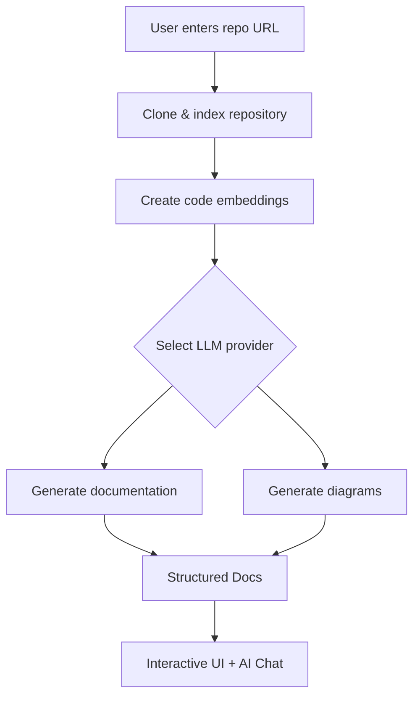
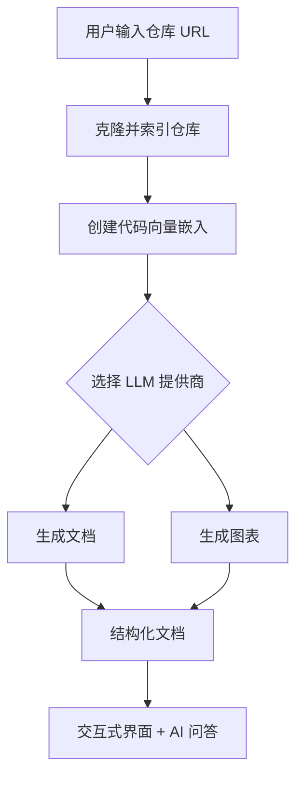

# RepoHelper

> AI-powered repository documentation generator

RepoHelper analyzes any GitHub, GitLab, or Bitbucket repository and produces structured, navigable technical documentation enriched with Mermaid diagrams. It also supports local folder analysis, PDF/PPT/video export, and interactive AI chat powered by RAG.

---

## Features

| Capability | Description |
|---|---|
| **Auto Documentation** | Auto-generates multi-page documentation from repository code structure |
| **Diagram Generation** | Mermaid flow charts, sequence diagrams, and architecture visuals |
| **AI Chat (Ask)** | RAG-powered Q&A — ask questions about any repository |
| **Multi-provider LLM** | Google Gemini, OpenAI, OpenRouter, Azure OpenAI, Ollama, AWS Bedrock, DashScope |
| **Flexible Embeddings** | OpenAI, Google AI, Ollama, or Bedrock embedding backends |
| **Export** | PDF reports, PowerPoint slides, video overviews, Markdown, JSON |
| **Private Repos** | Secure token-based access for GitHub / GitLab / Bitbucket private repositories |
| **Local Analysis** | Point to a local folder path instead of a remote URL |
| **i18n** | English & Chinese UI, extensible to more languages |
| **Dark / Light Theme** | System-aware theme toggle |

---

## Quick Start

### Option A — Docker (Recommended)

```bash
git clone https://github.com/AsyncFuncAI/deepwiki-open.git
cd deepwiki-open

# Create .env with at least one provider key
cat > .env <<EOF
OPENAI_API_KEY=sk-...
GOOGLE_API_KEY=AI...
# Optional
OPENROUTER_API_KEY=...
AZURE_OPENAI_API_KEY=...
AZURE_OPENAI_ENDPOINT=...
AZURE_OPENAI_VERSION=...
OLLAMA_HOST=http://localhost:11434
DEEPWIKI_EMBEDDER_TYPE=openai   # openai | google | ollama | bedrock
EOF

docker-compose up
```

Open <http://localhost:3000>.

> Data is persisted at `~/.adalflow` (repos, embeddings, documentation cache).

### Option B — Manual Setup

```bash
# 1. Backend
pip install poetry==2.0.1 && poetry install -C api
python -m api.main          # Starts on :8001

# 2. Frontend
yarn install                # or npm install
yarn dev                    # Starts on :3000
```

---

## How It Works



1. Clone and analyze the repository (supports private repos with token auth)
2. Create vector embeddings of the code for smart retrieval
3. Generate documentation with context-aware AI
4. Create visual diagrams to explain code relationships
5. Organize everything into structured, navigable documentation
6. Enable intelligent Q&A and deep research via the Ask feature

---

## Architecture

```
RepoHelper/
├── api/                    # Python FastAPI backend
│   ├── main.py             # Entry point
│   ├── api.py              # Route definitions
│   ├── rag.py              # Retrieval Augmented Generation
│   ├── data_pipeline.py    # Repo cloning, indexing, embedding
│   ├── export_service.py   # PDF / PPT / video export
│   ├── config/             # generator.json, embedder.json, repo.json
│   └── tools/              # Embedder utilities
│
├── src/                    # Next.js 15 frontend (React 19)
│   ├── app/                # App Router pages
│   │   ├── page.tsx        # Home — repo input + feature overview
│   │   └── [owner]/[repo]/ # Documentation viewer page
│   ├── components/         # Reusable UI components
│   ├── contexts/           # Language context provider
│   └── messages/           # i18n JSON (en, zh)
│
├── docker-compose.yml
├── Dockerfile
└── .env                    # Your API keys (create this)
```

---

## Environment Variables

| Variable | Purpose | Required |
|---|---|---|
| `OPENAI_API_KEY` | OpenAI models & default embeddings | If using OpenAI |
| `GOOGLE_API_KEY` | Google Gemini models & Google embeddings | If using Google |
| `OPENROUTER_API_KEY` | OpenRouter model access | If using OpenRouter |
| `AZURE_OPENAI_API_KEY` | Azure OpenAI | If using Azure |
| `AZURE_OPENAI_ENDPOINT` | Azure endpoint | If using Azure |
| `AZURE_OPENAI_VERSION` | Azure API version | If using Azure |
| `OLLAMA_HOST` | Ollama server URL (default `http://localhost:11434`) | If using Ollama |
| `AWS_ACCESS_KEY_ID` / `AWS_SECRET_ACCESS_KEY` | AWS Bedrock credentials | If using Bedrock |
| `DEEPWIKI_EMBEDDER_TYPE` | `openai` \| `google` \| `ollama` \| `bedrock` | No (default `openai`) |
| `OPENAI_BASE_URL` | Custom OpenAI-compatible endpoint | No |
| `DEEPWIKI_CONFIG_DIR` | Custom config directory path | No |
| `DEEPWIKI_AUTH_MODE` | `true` to require auth code | No |
| `DEEPWIKI_AUTH_CODE` | Secret code when auth mode is enabled | If auth mode on |
| `PORT` | API server port (default `8001`) | No |
| `SERVER_BASE_URL` | Backend URL for frontend proxy (default `http://localhost:8001`) | No |
| `LOG_LEVEL` | `DEBUG` / `INFO` / `WARNING` / `ERROR` | No (default `INFO`) |
| `LOG_FILE_PATH` | Custom log file path | No |

---

## Supported LLM Providers

| Provider | Default Model | Examples |
|---|---|---|
| **Google** | `gemini-2.5-flash` | `gemini-2.5-pro`, `gemini-2.5-flash-lite` |
| **OpenAI** | `gpt-4o` | `gpt-4o-mini`, `o3-mini` |
| **OpenRouter** | configurable | Claude, Llama, Mistral, and hundreds more |
| **Azure OpenAI** | `gpt-4o` | `o4-mini` |
| **Ollama** | `llama3` | Any locally installed model |
| **AWS Bedrock** | configurable | Amazon-hosted models |
| **DashScope** | `qwen-plus` | `qwen-turbo`, `deepseek-r1` |

---

## Embedding Backends

| Type | Model | Key Required |
|---|---|---|
| `openai` (default) | `text-embedding-3-small` | `OPENAI_API_KEY` |
| `google` | `text-embedding-004` | `GOOGLE_API_KEY` |
| `ollama` | configurable | None (local) |
| `bedrock` | Amazon Titan / Cohere | AWS credentials |

Switch with `DEEPWIKI_EMBEDDER_TYPE` env var. When switching, regenerate repository embeddings.

---

## Docker

```bash
# Pull & run
docker pull ghcr.io/asyncfuncai/deepwiki-open:latest
docker run -p 8001:8001 -p 3000:3000 \
  --env-file .env \
  -v ~/.adalflow:/root/.adalflow \
  ghcr.io/asyncfuncai/deepwiki-open:latest
```

Or build locally:

```bash
docker build -t repohelper .
docker run -p 8001:8001 -p 3000:3000 --env-file .env -v ~/.adalflow:/root/.adalflow repohelper
```

For Ollama + Docker, see [Ollama-instruction.md](Ollama-instruction.md).

---

## Troubleshooting

| Problem | Solution |
|---|---|
| Missing API key errors | Check `.env` is in project root with correct keys |
| Cannot connect to API | Ensure backend is running on port 8001 |
| Large repo fails | Try a smaller repo first, or use file filters to exclude directories |
| Diagram render error | Auto-repair is attempted; refresh if needed |
| Private repo 403 | Verify your personal access token has read permissions |

---

## Contributing

Issues and pull requests are welcome.

## License

MIT — see [LICENSE](LICENSE).

---
---

# RepoHelper（中文说明）

> AI 驱动的代码仓库文档自动生成工具

RepoHelper 可以分析任意 GitHub、GitLab 或 Bitbucket 仓库，自动生成结构化、可导航的技术文档，并附带 Mermaid 架构图。同时支持本地文件夹分析、PDF/PPT/视频导出，以及基于 RAG 的智能问答。

---

## 功能一览

| 功能 | 说明 |
|---|---|
| **自动文档生成** | 根据代码结构自动生成多页文档 |
| **图表生成** | Mermaid 流程图、时序图、架构可视化 |
| **AI 问答 (Ask)** | 基于 RAG 的仓库智能问答 |
| **多模型支持** | Google Gemini、OpenAI、OpenRouter、Azure OpenAI、Ollama、AWS Bedrock、DashScope |
| **灵活的嵌入后端** | OpenAI、Google AI、Ollama 或 Bedrock 向量化 |
| **导出** | PDF 报告、PPT 演示文稿、视频概览、Markdown、JSON |
| **私有仓库** | 通过 Token 安全访问 GitHub / GitLab / Bitbucket 私有仓库 |
| **本地分析** | 支持直接指定本地文件夹路径 |
| **多语言界面** | 中英文 UI，可扩展 |
| **明暗主题** | 跟随系统或手动切换 |

---

## 快速开始

### 方式一 — Docker（推荐）

```bash
git clone https://github.com/AsyncFuncAI/deepwiki-open.git
cd deepwiki-open

# 创建 .env，至少填写一个模型提供商的 Key
cat > .env <<EOF
OPENAI_API_KEY=sk-...
GOOGLE_API_KEY=AI...
# 可选
OPENROUTER_API_KEY=...
AZURE_OPENAI_API_KEY=...
AZURE_OPENAI_ENDPOINT=...
AZURE_OPENAI_VERSION=...
OLLAMA_HOST=http://localhost:11434
DEEPWIKI_EMBEDDER_TYPE=openai   # openai | google | ollama | bedrock
EOF

docker-compose up
```

浏览器打开 <http://localhost:3000>。

> 数据持久化目录：`~/.adalflow`（包含克隆仓库、嵌入向量、文档缓存）。

### 方式二 — 手动部署

```bash
# 1. 后端
pip install poetry==2.0.1 && poetry install -C api
python -m api.main          # 启动在 :8001

# 2. 前端
yarn install                # 或 npm install
yarn dev                    # 启动在 :3000
```

---

## 工作原理



1. 克隆并分析仓库（支持通过 Token 访问私有仓库）
2. 创建代码向量嵌入，用于智能检索
3. 使用上下文感知 AI 生成文档
4. 创建可视化图表解释代码关系
5. 将所有内容组织为结构化、可导航的技术文档
6. 通过 Ask 功能提供智能问答和深度研究

---

## 项目结构

```
RepoHelper/
├── api/                    # Python FastAPI 后端
│   ├── main.py             # 入口
│   ├── api.py              # 路由定义
│   ├── rag.py              # 检索增强生成
│   ├── data_pipeline.py    # 仓库克隆、索引、嵌入
│   ├── export_service.py   # PDF / PPT / 视频导出
│   ├── config/             # generator.json, embedder.json, repo.json
│   └── tools/              # 嵌入工具
│
├── src/                    # Next.js 15 前端 (React 19)
│   ├── app/                # App Router 页面
│   │   ├── page.tsx        # 首页 — 仓库输入 + 功能概览
│   │   └── [owner]/[repo]/ # 文档查看页
│   ├── components/         # 可复用组件
│   ├── contexts/           # 语言上下文
│   └── messages/           # 多语言 JSON (en, zh)
│
├── docker-compose.yml
├── Dockerfile
└── .env                    # API 密钥（需自行创建）
```

---

## 环境变量

| 变量 | 用途 | 是否必需 |
|---|---|---|
| `OPENAI_API_KEY` | OpenAI 模型及默认嵌入 | 使用 OpenAI 时需要 |
| `GOOGLE_API_KEY` | Google Gemini 模型及嵌入 | 使用 Google 时需要 |
| `OPENROUTER_API_KEY` | OpenRouter 模型 | 使用 OpenRouter 时需要 |
| `AZURE_OPENAI_API_KEY` | Azure OpenAI | 使用 Azure 时需要 |
| `OLLAMA_HOST` | Ollama 服务地址（默认 `http://localhost:11434`） | 使用 Ollama 时需要 |
| `DEEPWIKI_EMBEDDER_TYPE` | `openai` \| `google` \| `ollama` \| `bedrock` | 否（默认 `openai`） |
| `OPENAI_BASE_URL` | 自定义 OpenAI 兼容端点 | 否 |
| `DEEPWIKI_CONFIG_DIR` | 自定义配置目录路径 | 否 |
| `DEEPWIKI_AUTH_MODE` | 设为 `true` 启用访问码 | 否 |
| `DEEPWIKI_AUTH_CODE` | 授权码 | 启用 AUTH_MODE 时需要 |
| `PORT` | API 服务端口（默认 `8001`） | 否 |
| `SERVER_BASE_URL` | 前端代理的后端 URL（默认 `http://localhost:8001`） | 否 |
| `LOG_LEVEL` | `DEBUG` / `INFO` / `WARNING` / `ERROR` | 否（默认 `INFO`） |

---

## 支持的 LLM 提供商

| 提供商 | 默认模型 | 其他示例 |
|---|---|---|
| **Google** | `gemini-2.5-flash` | `gemini-2.5-pro`、`gemini-2.5-flash-lite` |
| **OpenAI** | `gpt-4o` | `gpt-4o-mini`、`o3-mini` |
| **OpenRouter** | 可配置 | Claude、Llama、Mistral 等上百种模型 |
| **Azure OpenAI** | `gpt-4o` | `o4-mini` |
| **Ollama** | `llama3` | 任何本地安装的模型 |
| **AWS Bedrock** | 可配置 | Amazon 托管模型 |
| **DashScope** | `qwen-plus` | `qwen-turbo`、`deepseek-r1` |

---

## 嵌入后端

| 类型 | 模型 | 所需密钥 |
|---|---|---|
| `openai`（默认） | `text-embedding-3-small` | `OPENAI_API_KEY` |
| `google` | `text-embedding-004` | `GOOGLE_API_KEY` |
| `ollama` | 可配置 | 无（本地） |
| `bedrock` | Amazon Titan / Cohere | AWS 凭证 |

通过 `DEEPWIKI_EMBEDDER_TYPE` 环境变量切换。切换后需重新生成仓库嵌入。

---

## Docker 部署

```bash
# 拉取并运行
docker pull ghcr.io/asyncfuncai/deepwiki-open:latest
docker run -p 8001:8001 -p 3000:3000 \
  --env-file .env \
  -v ~/.adalflow:/root/.adalflow \
  ghcr.io/asyncfuncai/deepwiki-open:latest
```

本地构建：

```bash
docker build -t repohelper .
docker run -p 8001:8001 -p 3000:3000 --env-file .env -v ~/.adalflow:/root/.adalflow repohelper
```

Ollama + Docker 详见 [Ollama-instruction.md](Ollama-instruction.md)。

---

## 常见问题

| 问题 | 解决方法 |
|---|---|
| 缺少 API Key | 检查 `.env` 是否位于项目根目录且 Key 正确 |
| 无法连接 API | 确认后端在 8001 端口运行 |
| 大型仓库失败 | 先尝试较小的仓库，或使用文件过滤排除目录 |
| 图表渲染错误 | 系统会自动修复，刷新页面即可 |
| 私有仓库 403 | 确认 Token 拥有读取权限 |

---

## 贡献

欢迎提交 Issue 和 Pull Request。

## 许可证

MIT — 详见 [LICENSE](LICENSE)。
